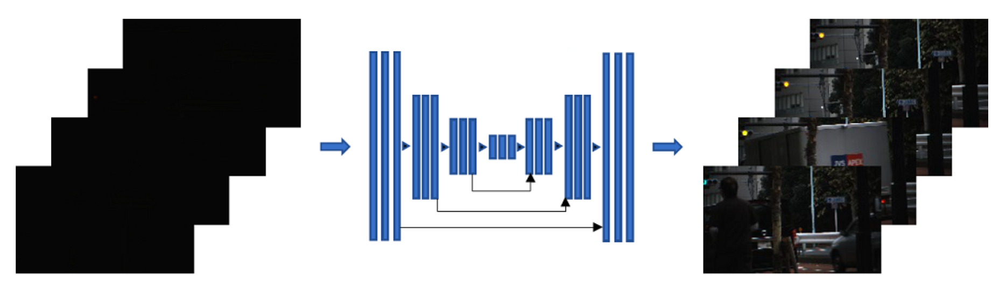
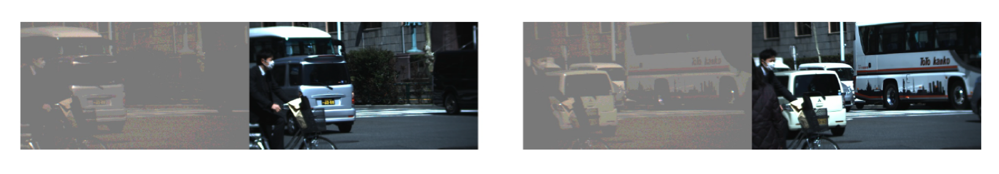
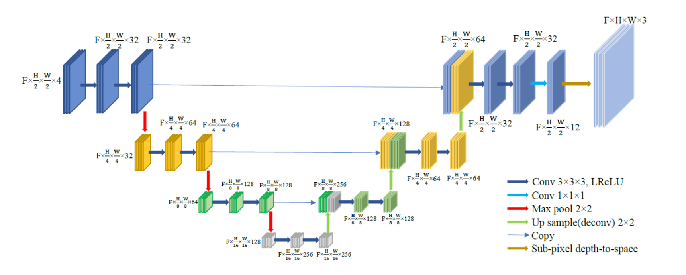
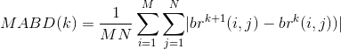
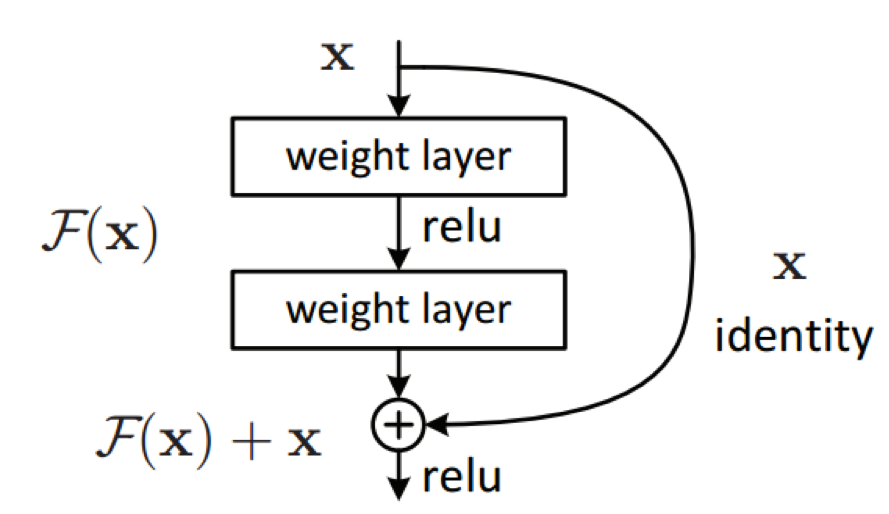
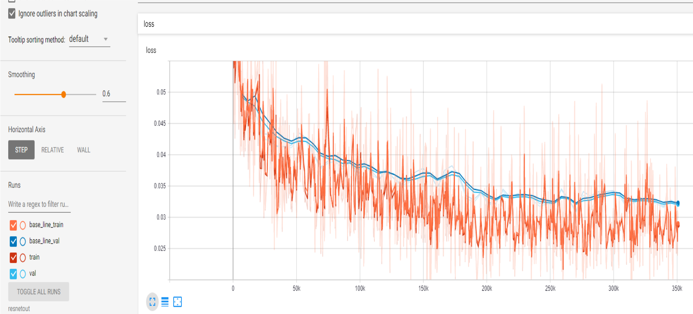
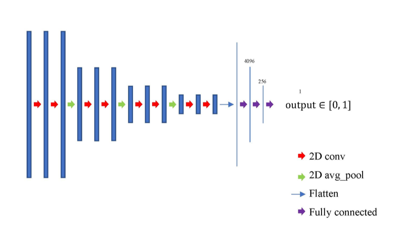

# Extreme Dark Video Enhancement

#### USC 2019 Fall CSCI 566 Course Project
#### Team Name : *Ocean's Five* 
This project aims to directly enhance extreme low light videos captured by ordinary cameras.

### [Demo Video](https://youtu.be/XTlWN0xPwQE)
---

#### Table of Contents

   * [Motivation](#motivation)
   * [Problem Statement](#problem-statement)
   * [Methodology](#methodology)
      * [Dataset](#dataset)
      * [Pipeline](#pipeline)
   * [Experiments](#experiments)
      * [Baseline](#baseline)
      * [Approach 1: Batch Update](#approach-1-batch-update)
      * [Approach 2: Multiple Loss Functions](#approach-2-multiple-loss-functions)
      * [Approach 3: Residual Blocks](#approach-3-residual-block)
      * [Approach 4: GAN](#approach-4-gan)
      * [Benchmarking](#benchmarking)
   * [Conclusion](#conclusion)
   * [Usage](#usage)
      * [Prerequisites](#prerequisites)
      * [Commands](#commands)
   * [Q&A](#q&a)
   * [References](#references)
   * [Author Information](#author)

## Motivation
Restoring information from extreme dark videos has vast practical potentials. For instance, documentary filming that requires zero artificial light source, like observation of wild animals at night; surveillance footage of dark places; and autonomous driving systems at night, etc.

Current industrial solutions to such cases mainly involve near-infrared (NIR) LED. They help to gain better vision in low-light environments but also introduce drawbacks compared to natural light cameras. The inevitable energy consumption and heat generation with the presence of extra light sources can increase operation and maintenance costs. More significantly, visible color and texture information could suffer from extensive loss by using such systems. Thus, we want to train a dark video enhancement network which can dramatically save the maintenance cost and ensure our vedio qualities.



## Problem Statement
Enhancing dark videos from raw sensor data is challenging in that:

1. inputs are noisy;
2. there is temporal continuity among frames;
3. denoising incurs blur.

Extreme dark videos are of low contrast, distorted color mapping, and high noise level. Low-light scenes usually have low signal-to-noise (SNR) rate. Useful information is compressed in a narrow range of pixel values, while noises can easily reach similar or even stronger responses on optical sensors. With light intensity being small, sensors' response curves to various light frequencies are likely to change, different from those that are under well illuminated circumstances. This changes recorded color mapping of objects.
For videos, they not just a stack of pictures. They are pictures in specific seqences. Ordering intails context information among time axis. Restoring from frames separately can bring visible instability over time. 
Lastly, denoising algorithms often require knowledge on adjacent or global pixel values, and use an average/median value to estimate outliers which will later be viewed as a noise point and adjusted. However, this dampens sharp transitions of edges, in which case pictures become, to some extent, blurry.
Although, admittedly there is no theoretical optimal solution for these three aspects yet, our method tries to reach a possible balance among them.

## Methodology
### Dataset
Original dataset is from paper [[3]](#reference). A novel optical system with a beam splitter, a neutral density (ND) filter and a signal generator was built to collect 179 video pairs of street views with moving vehicles and pedestrians. The beam splitter feeds light into two synchronized cameras concurrently and one of the cameras is equipped with an ND filter. In this way, perfectly matched videos with only light illumination differences can be obtained. The input dark videos are chronologically organized Bayer pattern filtered raw images. The ground truth bright videos are in sRGB space, encoded in mp4 format for the convenience of visualizing and post-processing.

We down-sampled the videos with a factor of 3 on width and height (i.e. 1/9 of original size), in order to save training and testing time. Sizes of down-sampled frames are around 340 × 620 pixels. All raw data have been packed and stored in numpy arrays for fast read-in and convenience of processing. A subset of key frames are shown in the following figure.


We also provide a comparison between linearly scaled input frames and their corresponding ground truth frames in the next figure, to illustrate pixel-level alignment between training input and ground truth. Frames of input videos are linearly scaled to provide more details of objects and noise level. It can be seen from the figure that there are challenges of low contrast, high noise level, and unnatural color mapping in our task. 



| Dataset | Number of video pairs | Number of Frames |
| --- | --- | --- |
| Training | 125 | 200 |
| Validation | 27 | 200 |
| Test | 27 | 200 |

### Pipeline

**Pre-processing.** A global histogram equalization approach is adopted. The reason for this operation is that it can largely help alleviate low contrast problem in frames. With less challenge, training a neural network can be more tractable. A smaller model can be used as well with less risk of overfitting. Another reason for this pre-processing is that, for a fully convolutional network (FCN, as in [[1]](#references), [[2]](#references), [[3]](#references)), even in its bottleneck layers, a pixel in a feature map cannot cover a complete range of vision in the original frames. It can only connect to a smaller window in the input images/videos. This makes FCN requires much harder work to learn a global transformation, which is why we single out a global change into becoming a pre-processing step.
Videos in our training set had been histogram equalized before being saved as npy files so that this pre-processing step can be skipped during training phase. A histogram equalization function is applied to videos before being sent into our network during test phase.

**Network.** We use a 3D U-Net model as the basic network in our project. The U-Net is originally used for segmentation of images in medical and biomedical fields by using convolutional networks with upsampling functions. Because the type of our input data is video, we modified the dimensions of input to the network from 2D to 3D. We use 3D convolution layers, yet, keep pooling layers being 2D, for the reason that downsampling on time axis would affect temporal continuity. The depth of U-Net, denoted by the number of downsampling layers, between two and four, typically in three. The following figure illustrates the details about our network structure.



**Training.** Theoretically, FCNs like U-Net can take in inputs with arbitrary sizes, since there are only conv, pool, deconv layers, no fully connected layers. However, we had to crop the input into small pieces due to the GPU memory limitation. The crop size we used is 16 × 128 × 128. 16 represents number of frames and 128 represents height and width. Random flipping and transpose on spatial dimensions were carried out for data augmentation purpose. We used Adam optimizer with default parameters (except for learning rate). Loss function is L1 loss between output videos and corresponding areas in ground truth. Initial learning rate is 10^-4, and it decays to 10^-5 after 30 epochs. Entire training process proceeded for 60 epoches. This setting is defined as our Baseline Approach.

## Experiments

### Baseline
Loss value during training process of baseline model:


Qualitative result of our baseline model can be found in our [demo video](https://youtu.be/XTlWN0xPwQE).
The quantitative evaluation we use is average peak signal-to-noise ratio ([PSNR](https://en.wikipedia.org/wiki/Peak_signal-to-noise_ratio)), average structural similarity ([SSIM](https://en.wikipedia.org/wiki/Structural_similarity)), and mean average [brightness](https://en.wikipedia.org/wiki/Relative_luminance) difference ([MABD[3]](#reference)). The former two, PSNR and SSIM, are spatial evaluations. They measure to what extent frames in the output are similar to the those in ground truth. The last one, MABD, is defined as: 
<div align="center"></div>
M,N are height and width of frames, br^{k}(i, j) is the  brightness of pixel (i,j) at frame k, with being in the range from 1 to 200. This term measures differences between each consecutive frames. It can be viewed as a general level of derivatives of brightness values w.r.t. time on each pixel location. Because one video can have a MABD vector of length 199, we calculate the mean square error (MSE) between the output's MABD vector and ground truth's MABD vector. This should serve as a measurement on temporal stability of restored videos. PSNR and SSIM are the bigger the better, meaning more similarities between reconstruction and ground truth, while MSE(MABD) is the smaller the better, meaning more stable over time (i.e. less likely to flicker).

Quantitative result of the baseline model:

| Model | Final Loss | Final Validation Loss | PSNR | SSIM | MSE (MABD) Level: 10^-3 |
| --- | --- | --- | --- | --- | --- |
| Baseline | 0.029254 | 0.031946 | 27.203 | 0.83994 | 0.72762 |

In addition to the Baseline model, we also exprimented several optimization methods, including GAN setting, residual blocks, multiple loss functions and finetuning hyper parameters.

### Approach 1 Batch Update

See [Batch Branch](https://github.com/MichaelHYJiang/csci566-Ocean-s-Five/tree/batch) for code and details.
Baseline updates loss for one sample in an iteration (i.e. similar to SGD). We modify network and train process to make the code suitable for mini-batch weight update. Due to the memory limitation, we only test batch size <= 23. Mini-batch gradient descent converges to a smaller noise ball compared to SGD.

**Results** 

|Batch Size | Final Loss | Final Validation Loss | PSNR | SSIM | MSE (MABD) Level: 10^-3 |
| --- | --- | --- | --- | --- | --- |
| baseline | 0.029254 | 0.031946 | 27.203 | 0.83994 | 0.72762 |
| 1  | 0.030137 | 0.037942 | 26.301 | 0.82867 | 0.56897|
| 10 | 0.25526 | 0.20713 | 12.733 | 0.44953 | 5.2412|
| 23 | 0.25735 | 0.23038 | 11.785 | 0.36570 | 8.0329|
* Baseline is using original network and training process without batch update. Epoch = 60, Group number = 12
* Batch size = 1, 10, 23 are using modified network with mini-batch weight update. For memory and time limitation, we set epoch = 30, group number = 5. Other parameters are the same as baseline.
* Group number is an implement parameter to control number of videos read into the memory at each time. It is different from batch size. For each cropped video, losses are back-propagated separately. While in the batch update settings, losses are back-propagated together after iterations on all instances in a batch.

**Conclusions** 
* Use batch size > 1 can speed up the training process. (batch size = 10 is 2 times faster than baseline)
* When batch size is large, it uses more memory to train. In this case, I choose 30GB memory for the virtual machine, it cannot handle batch size > 23.
* When batch size is larger, the performance actually becomes worse, as loss and MSE are larger, but PSNR and SSIM are smaller.
* From the loss information after each update, it seems that mini-batch jumps into local minimum and gets stuck in it, while SGD jumps out of local minimum and get global minimum.
* Because of the memory limitation, we do not test batch size > 23, maybe there will be better batch size to fit this network and perform better than baseline.

### Approach 2 Multiple Loss Functions

1. **L1-Loss**. This loss is used in baseline. It computes average absolute difference for each pixel.

2. **Regional-Loss**. It is the same as L1-Loss but we separate dark and bright regions and set different weights for them two, normally 4:1. Usually we set the threshold as 0.7 to separarte dark and bright regions in (0,1) range type.

3. **Structure-Loss**. The SSIM is a very standard method means structural similarity index with its value in range (-1,1). We use the gap between it and 1 as the structure loss.

4. **VGG-Loss**. We use both the generated image and its corresponding output image to send into pretrained VGG19 network model and get their L1-Loss from convolution layers from 1 to 4 as sum of losses together.

**Results** 

|Loss | Final Loss | Final Validation Loss | PSNR | SSIM | MSE (MABD) Unit: 10^-3 |
| --- | --- | --- | --- | --- | --- |
| L1 Loss (baseline) | 0.029254 | 0.031946 | 27.203 | 0.83994 | 0.72762 |
| Structure Loss | 0.18124 | 0.20149 | 26.708 | 0.85367↑ | 1.5242 |
| Region Loss | 0.15896 | 0.17681 |27.235↑ | 0.84026↑ | 0.48029↓ |
|VGG Loss (Add vgg19) | 139.37 | 150.84 | 27.022 | 0.83217 | 0.16277↓|
|Multi Loss1 (Str Reg VGG) |1.7529 |1.9128 | 27.229↑ | 0.84750↑ | 0.37438↓|
|Multi Loss2 (L1 Str Reg) | 0.35868 | 0.40669 | 27.065 | 0.85222↑ | 2.3925 | 

(Arrows denote advantage over baseline model.)

**Conclusions** 
* Compared to L1-Loss as baseline, using structure loss may help improve SSIM(structural similarity index), which means the better relationship of one pixel to its neighbors.
* Using higher conv layer outputs difference of VGG network as loss does not help improve the result.
* Using the combination loss of L1 loss, Regional loss and Structure loss for training can improve both MABD and SSIM.

### Approach 3 Residual Block

Deep Neural Networks usually face the degradation problem. In this approach we add a residual to the previous value to each block of layers rather than produce an entirely new value. We replace our convolution blocks in Unet with residual blocks. Since there are lots
of dimention changes in Unet, we have to add a 1x1x1 convolution projection on input to match dimension.



**Results** 

|Setting |Final Loss | Final Validation Loss | PSNR | SSIM | MSE (MABD) Unit: 10^-3|
| --- | --- | --- | --- | --- | --- |
|Baseline | 0.029254 | 0.031946 | 27.203 | 0.83994 | 0.72762 |
|ResNet | 0.028980 | 0.031731 | 27.438↑ | 0.84142↑ | 0.18700↓ |



**Conclusions**
The adoption of Residual Blocks improved all metrics across the board, also the additional 1x1x1 convolution projection didn't indroduce
noticable training time increase. The tensorboard graph shows that loss optimization is much more stable in the case of ResNet which is
expected.

### Approach 4 GAN

After playing with a number manually designed loss functions, we decided to move on to letting networks learn a unique loss function on itself, i.e. modifying it to a GAN setting. We maintained 3D U-Net as a generator. We added a discriminator with 4 conv blocks and 3 fully connected layers as shown below.



It outputs a likelihood of its inputs' authenticity. Cross entropy loss on discriminator's outputs is used. A 16-frame output video is set as a training input image batch ("fake batch", batch size = 16) with labels being all zero, while its corresponding 16-frame ground truth video is another batch ("real batch", batch size = 16) with labels being all one. Generator and discriminator update their weights separately, with former depending on cross entropy loss of a fake batch, and latter on that of both batches. Zeros and ones are set accordingly, as the case in homework2 of this course.

**Results** 

|Setting |Final Loss | Final Validation Loss | PSNR | SSIM | MSE (MABD) Unit: 10^-3 |
| --- | --- | --- | --- | --- | --- |
|Without GAN (baseline) | 0.029254 | 0.031946 | 27.203 | 0.83994 | 0.72762 |
|With GAN | 0.029073 | 0.032091 | 27.384↑ | 0.84086↑ | 0.14062↓ | 

GAN setting showed trivial advantage over the baseline case. When we reexamined the discriminator's output, it turned out that the discriminator failed to distinguish fake and real batches at fairly early stage. Finetuning of this GAN model is required, for the capacity and training speed might vary hugely between the generator and discriminator. Due to the time consumption and limit, we didn't have further exploration in this direction.

### Benchmarking
Multi-Loss1, ResNet and GAN all show better measurements than the baseline model. Among them, ResNet has the most ballanced result: it has PSNR and MABD better than Multi Loss1, and PSNR and SSIM better than GAN result.

|Setting| PSNR | SSIM | MSE (MABD) Unit: 10^-3 |
| --- | --- | --- | --- |
|Multi Loss1| 27.229↑ | 0.84750↑ | 0.37438↓| 
|ResNet | 27.438↑ | 0.84142↑ | 0.18700↓ |
|GAN | 27.384↑ | 0.84086↑ | 0.14062↓ | 

We picked ResNet as our best model to compete against three state-of-the-art dark image/video enhancement methods [[1][2][3]](#references). Implementations of [[1]](#references) and [[2]](#references) can be found in [state-of-the-art](./state-of-the-art/) folder in this repository. They were trained on our downsampled dataset with modifications to make them run smoothly. [[3]](#reference) has a publicly available checkpoint file. We used that directly.

|Setting| PSNR | SSIM | MSE (MABD) Unit: 10^-3 |
| --- | --- | --- | --- |
| Our ResNet | 27.438 | 0.84142 | 0.18700 | 
|CVPR 2018[[1]](#references) | 27.039 | 0.81556 | 0.96960 |
|BMVC 2018[[2]](#references) | 24.600 | 0.79418 | 0.18450 |
|ICCV 2019[[3]](#references) | 22.891 | 0.73099 | 0.22020 |

From the chart above, we can see that our method achieved the best result among all contestants. Qualitative results corroborates this fact. They are included in our [demo video](https://youtu.be/XTlWN0xPwQE).

## Conclusion
* Successfully implemented a extreme dark video enhancement method.
* Modifications show improvements to original model. (GAN, ResNet, MultiLoss v.s. baseline)
* Achieved Comparable and even better than the state-of-the-art on our dataset.

**Limitations.** 
* All training, test, evaluation are done only on the downsampled dataset.
* Not thoroughly searched for all possible combinations. (Time and Computation resource limits)

**Future Work.** 
* Ensemble / combinations of optimizations.
* Develope new layers / branches that takes in histogram information. (Incoporate histogram equalization into the network)

## Usage

### Prerequisites

- [Python 2.7](https://www.python.org/download/releases/2.7/)
- [Tensorflow 1.1.14](https://www.tensorflow.org/versions/r1.14/api_docs/python/tf)
- [NumPy](http://www.numpy.org/)
- [scikit-video](http://www.scikit-video.org/stable/io.html)
- [OpenCV2](https://pypi.org/project/opencv-python/)

### Commands
1. Download dataset from Google Cloud first. Put it in *0_data* directory and unzip it.

2. #### Generate file lists
```Shell
python generate_file_list.py
```

3. #### Training
```Shell
python train.py
```
We also uploaded our best model to a google drive. One can skip training by:
```Shell
python download_models.py
```
There are three videos as toy examples uploaded to a google drive. Download them with:
```Shell
python download_dataset.py
```
 
4. #### Testing
```Shell
python test.py [test_case]
```
**test_case** can be:

**0**		test on training set

**1**		test on validation set

**2**		test on test set(save npy results)

**3**		test on customized set

All cases save mp4 output videos, while case 2 saves extra npy results.

5. #### Evaluation
```Shell
python psnr_ssim_mabd.py
```

## Q&A
A summary of answers during question session on presentation of Dec. 3rd.

1. How did you acquire your dataset?

	#### Ans: Original dataset was from paper [[3]](#references). In that paper a novel optical system is put forward. It consists of a beam splitter, a neutral density filter, a signal generator and 2 cameras. It can record pairs of bright and dark videos of the exact same scene at the same time. We described a little about it in our report section [Dataset](#dataset). More details can be found in the original paper. The dataset was originally designed for the dark video enhancement of tasks. In our project, we downsampled it by a factor of 3 on both height and width of frames.

2. Was the videos filmed during night or under the daylight?

	#### Ans: Videos of the original dataset were all filmed at sufficiently illuminated places, because it needs to generate bright videos as ground truths. However, both paper [[3]](#references) and our project tested on real world night videos and achieved visually pleasing results. (See [demo video](https://youtu.be/XTlWN0xPwQE))

3. How was your result compared to state-of-the-art methods?

	#### Ans: We compared our best solution, a ResNet model, with a CVPR' 18 [[1]](#references) method, a BMVC' 18 [[2]](#references) method, and an ICCV' 19 [[3]](#references) method. The CVPR' 18 is a image enhancement method that has way less stability along time axis than ours. The BMVC' 18 one trained slower, requires larger computational resources. It introduced artifacts into its results. The ICCV' 19 one was trained on the original high definition dataset, and introduces more blur than our updated models. Quantitative results of these comparisons can be found in [Benchmarking](#benchmarking) of this report. Qualitative comparisons are in our [demo video](https://youtu.be/XTlWN0xPwQE).


## References
[1] [Learning to See in the Dark](https://arxiv.org/pdf/1805.01934.pdf). Chen Chen, Qifeng Chen, Jia Xu and Vladlen Koltun. The IEEE Conference on Computer Vision and Pattern Recognition (CVPR), 2018.

[2] [MBLLEN: Low-Light Image/Video Enhancement Using CNNs](http://bmvc2018.org/contents/papers/0700.pdf). Feifan Lv, Feng Lu, Jianhua Wu, and Chongsoon Lim. In British Machine Vision Conference 2018, BMVC 2018, Northumbria University, Newcastle, UK, September 3-6, 2018, page 220. BMVA Press, 2018.

[3] [Learning to See Moving Objects in the Dark](http://openaccess.thecvf.com/content_ICCV_2019/papers/Jiang_Learning_to_See_Moving_Objects_in_the_Dark_ICCV_2019_paper.pdf). Haiyang Jiang and Yinqiang Zheng.  Learning to see moving objects in the dark.  The IEEE International Conference on Computer Vision (ICCV), October 2019.

## Author Information
This TensorFlow implementation is written by **Ocean's Five**
* [Haiyang Jiang](https://github.com/MichaelHYJiang), haiyangj@usc.edu
* [Boyuan Wang](https://github.com/wangby511), boyuanwa@usc.edu
* [Feng Chi](https://github.com/chifeng1113), chi721@usc.edu
* [Yue Qin](https://github.com/qiny9492), qiny@usc.edu
* [Hongfa Huang](https://github.com/gordonxwong),hongfahu@usc.edu
